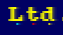
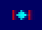

# RETO 1.P10: Pinta por la pantalla
Copia más abajo tus programas, cada uno en su parte del reto.

# PROGRAMAS

## Actividad 1: Píxel entre letras
El píxel debe estar fuera de la primera fila de pantalla.
```
3E 88 32 FD C0 18 FE
```
PC: 4000

## Actividad 2: Tres píxeles debajo de 3 letras
Los píxeles deben ser de 3 colores distintos y no estar en la primera fila de pantalla.
```
3E 88 32 D1 C1 3E 08 32 CF C1 3E 80 32 D3 C1 18 FE
```
PC: 4000

## Actividad 3: Columna de 5 píxeles consecutivos
Los píxeles deben formar un dibujito en vertical, en la misma columna.
```
3E 88 32 7E C0 3E 80 32 7E C8 3E 88 32 7E D0 3E 80 32 7E D8 3E 88 32 7E E0 18 FE
```
PC: 4000

## Actividad 4: Minidibujo en 3 columnas
Mínimo 4 filas de altura y 3 columnas distintas.
```
21 88 08 22 96 C0 3E 88 32 98 C0 21 89 0C 22 96 C8 3E 88 32 98 C8 21 8B 0E 22 96 D0 3E 88 32 98 D0 21 89 0C 22 96 D8 3E 88 32 98 D8 21 88 08 22 96 E0 3E 88 32 98 E0 18 FE
```
PC: 4000

# IMAGENES
Si quieres, puedes subir pantallazos y enlazarlos aquí.




